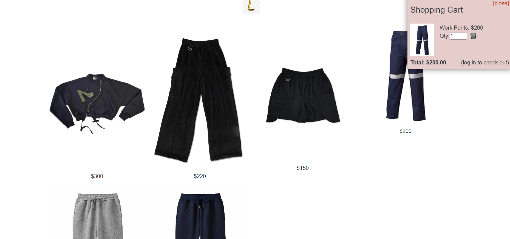

# fashion-e-commerce

## Table of Contents

[Description](#description)

[Installation Instructions](#installation)

[Usage Instructions](#usage)

[License](#license)

[Github](#github)

## Description

 A MERN stack application to be used by an independent designer to showcase their work and provide an online sales platform.

## Installation Instructions

Download from Github
npm install
npm run develop

alternately use link to deployed site

https://rocky-journey-99095.herokuapp.com/

## Usage Instructions

Log in or Sign up

View items

Add items to cart

Toggle cart

Checkout if logged in

## License

[Apache License 2.0](https://opensource.org/licenses/Apache-2.0)

## Github

[patrickthegu](https://github.com/patrickthegu)

